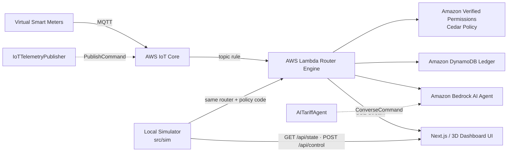

# SolNet AI — P2P Rooftop Solar Router & Virtual Microgrid

A runnable simulation of a neighborhood energy microgrid: virtual smart meters,
a learned solar/load forecaster, a forecast-driven tariff agent, a declarative
policy engine, and a peer-to-peer energy router — with a live animated dashboard.

**Track 03 — Waste & Energy.** 100% software, no hardware in the loop.

```
npm install
npm start           # dashboard on http://127.0.0.1:8787
npm run dev         # same, with --watch auto-restart
npm test            # 18 tests
npm run typecheck
npm run sim -- --ticks 288    # headless: simulate one day, print a summary
npm run check       # typecheck + tests

# AWS integrations (all offline-first, no credentials required)
npm run aws:lambda  # TEST_LAMBDA harness: run the Lambda energy router locally
npm run aws:iot     # publish a few smart-meter telemetry frames (mock MQTT)
npm run aws:bedrock # Bedrock AI tariff agent, deterministic heuristic fallback

# Deployment (needs the AWS SAM CLI + credentials)
npm run deploy:build
npm run deploy:router
```

Requires **Node 22.6+** (Node runs the TypeScript sources directly via type
stripping, so there is no build step for the local simulator). The three
`npm run aws:*` commands and the dashboard work fully offline: when AWS
credentials or the `USE_MOCK_*` flags are absent they switch to deterministic
local fallbacks instead of making network calls.

---

## What problem this models

Rooftop solar is routinely wasted: surplus is dumped to the utility at a low
feed-in tariff, or curtailed entirely when local voltage rises past the
inverter's trip threshold. Meanwhile the neighbours next door pay peak daytime
rates. SolNet AI routes that surplus to the appliances, EVs and houses that can
actually use it, and prices the transfer so both sides win.

## The stack

| Layer | What it does | Where |
|---|---|---|
| Virtual smart meters | 12 households, solar, batteries, EVs, appliance events, a two-timescale cloud process | `src/sim/` |
| Forecasting | One ridge model **per lookahead**, predicting the *correction to persistence* | `src/ml/` |
| Tariff agent | Forecast → reserve margin → scarcity → peer price; schedules flexible loads into the sunniest windows | `src/agent/tariffAgent.ts` |
| Policy engine | Cedar-style declarative rules: deny-by-default, `forbid` beats `permit` | `src/engine/policy.ts` |
| Energy router | solar → own load → battery → peers → grid → curtail, gated by policy and a voltage proxy | `src/engine/router.ts` |
| Ledger | Per-house kWh, credits, cash flows, savings vs a no-microgrid counterfactual | `src/engine/ledger.ts` |
| Server | Dependency-free HTTP + Server-Sent Events live stream, with heartbeat pulses | `src/server.ts` |
| Telemetry | Smart-meter frames → `solnet/neighborhood/telemetry` on AWS IoT Core | `src/aws/iotSimulator.ts` |
| Energy router (Lambda) | Cedar grid-safety checks + the priority router, returned as a proxy response | `src/aws/lambdaRouter.ts` |
| AI tariff agent | Bedrock `Converse` call returning `{tariff_adjustment_pct, reasoning}` | `src/aws/bedrockAgent.ts` |
| Dashboard | 3D microgrid (Three.js), glassmorphism HUD, live charts, AI reasoning log | `public/` |

## Why the forecasting layer is built this way

Three decisions were driven by measurements, not taste.

**1. Predict the clear-sky index, not kilowatts.** The model learns
`k = PV / (peak × clearSky)`, i.e. only the part physics cannot explain. The
deterministic solar-geometry curve supplies the rest, so the learned model does
not waste capacity re-learning sunrise.

**2. One model per horizon, not one model for all horizons.** Measured
correlation between the current clear-sky index and the index *h* minutes ahead
runs from **+0.81 at 15 min to −0.19 at 4 h** on this simulator. A single pooled
model averages those relationships away and collapses to the climatological mean
— it scored **−29% skill**, worse than doing nothing clever at all. Splitting per
lookahead fixed the sign of the problem.

**3. Fit the correction to persistence, with heavy shrinkage.** Each model
predicts `k(t+h) − k(t)`, so a zero weight reproduces naive persistence exactly
and the model can only improve on it. The ridge penalty is expressed as a
fraction of the row count (`0.8`), which acts as a *shrink-to-persistence prior*.
Measured skill across penalty values:

| penalty / rows | overall skill | worst horizon | short (30–60 min) | long (2–4 h) |
|---|---|---|---|---|
| 0.00 | −1.4% | −9.8% | −8.4% | +0.4% |
| 0.05 | +3.4% | 0.0% | +1.1% | +3.5% |
| 0.20 | +6.7% | +4.0% | +5.1% | +6.8% |
| **0.80** | **+9.1%** | **+5.8%** | **+6.9%** | **+9.4%** |
| 3.00 | +7.5% | +4.6% | +5.5% | +7.9% |

Two weeks of history are required, not two days: a couple of days contains only
a handful of independent weather systems, far too few to estimate multi-hour
cloud persistence.

## Measured results

12 households, 38.7 kW rooftop PV, 81.5 kWh storage, 9 EVs. Two simulated days
for each scenario, all three runs driven by an identical random seed, so
generation is bit-identical (518 kWh) and only the policy set differs.
Reproduce with `npm test` and by switching scenarios in the dashboard.

| Metric (2 days) | SolNet AI | Peers disabled | Weak feeder |
|---|---|---|---|
| Self-consumption | **85.5%** | 58.1% | 85.5% |
| Grid autonomy | **56.0%** | 38.0% | 56.0% |
| Peer energy traded | **142 kWh** | 0 | 142 kWh |
| Grid export | **75 kWh** | 217 kWh | 2 kWh |
| Grid import | **349 kWh** | 491 kWh | 349 kWh |
| Curtailed | 0 | 0 | **72.6 kWh** |
| Household savings | **$165** | $83 | $161 |

Peer routing cuts grid export by **65%** and grid import by **29%** against the
identical-weather counterfactual. The weak-feeder scenario shows what happens
without a healthy grid interface: the router cannot place 72.6 kWh of surplus and
has to spill it, because voltage has crossed the inverter's trip threshold.

Forecast quality, scored live on 60k+ out-of-sample predictions against
persistence: **+10% skill**, RMSE 2.5 kW vs 2.8 kW for persistence, MAPE ~14%.

> These are simulation results. The value of the project is that the mechanism is
> real and auditable — every number on the dashboard is recomputed from the
> models and the ledger at runtime, and the test suite asserts the invariants.

## Demo script

1. **Open the dashboard.** The 3D street shows every household: rooftops glow
   gold as generation rises, a green halo on the ground tracks each battery's
   state of charge, warm windows brighten with live demand, and cyan/purple
   particle streams travel between houses during active P2P trades. Drag to
   orbit, scroll to zoom.
2. **Read the tariff agent panel.** It shows the 4-hour energy balance, the
   scarcity index, and how the peer price was derived from the feed-in floor and
   the retail ceiling. Nothing is hard-coded.
3. **Watch the flexible load panel.** EV charges and heat-pump pre-heats get
   scheduled into the cheapest forecast windows and only run when their window
   arrives.
4. **Click "Peers disabled".** Self-consumption collapses and grid export jumps —
   the counterfactual, live.
5. **Click "Weak feeder".** Voltage crosses the trip threshold and the router
   curtails energy it cannot place. This is the failure mode peer routing exists
   to prevent.
6. **Check the model skill panel.** Positive skill at every horizon, with the
   regression coefficients visible for the 1-hour model.

Controls: pause, speed (1–12×), reset, scenario switching (`POST /api/control`).

## API

| Endpoint | Purpose |
|---|---|
| `GET /api/state` | current frame (stream payload + AI tariff log) |
| `GET /api/stream` | Server-Sent Events, one frame per simulated tick, plus a `: heartbeat` comment every 15 s |
| `GET /api/config` | household metadata, capacities, active policy set, scenarios, AI/telemetry mode |
| `POST /api/control` | `{speed (1–12×), paused, reset, cloud, scenario, policies}` |

SSE response headers: `Content-Type: text/event-stream`, `Cache-Control:
no-cache, no-transform`, `Connection: keep-alive`, `X-Accel-Buffering: no`.

## Cloud architecture



The three AWS modules wrap **the same** `src/engine/router.ts` and
`src/engine/policy.ts` used by the local simulator, so a decision taken in the
cloud and a decision taken in the demo are produced by one implementation.

| Module | AWS service | Offline fallback |
|---|---|---|
| `src/aws/iotSimulator.ts` | `IoTDataPlaneClient` + `PublishCommand` → `solnet/neighborhood/telemetry` (region `AWS_REGION \|\| us-east-1`) | `USE_MOCK_AWS_IOT=true` *or* missing credentials → `[MOCK AWS IOT] Published tick …` on stdout |
| `src/aws/lambdaRouter.ts` | Lambda proxy handler: Cedar grid-safety (voltage, feeder limits) + P2P priority routing | `--test` / `TEST_LAMBDA=true` runs it in-process with a synthetic neighborhood |
| `src/aws/bedrockAgent.ts` | `BedrockRuntimeClient` + `ConverseCommand`, model `anthropic.claude-3-5-sonnet-20241022-v2:0` (or `amazon.nova-micro-v1:0`) | `USE_MOCK_AWS_BEDROCK=true` *or* missing credentials → deterministic reserve-margin heuristic |

The dashboard's **Amazon Bedrock · AI tariff** panel is fed by the server: once
per simulated hour it calls the agent with `{cloud_cover_pct, solar_yield_kw,
lookahead_hours}` and appends the structured
`{tariff_adjustment_pct, reasoning}` reply to the log streamed with every frame.

## Deployment

`template.yaml` is an AWS SAM template:

- `EnergyRouterFunction` — `nodejs22.x`, TypeScript bundled at deploy time with
  esbuild (no runtime build step), invoked by an IoT topic rule on
  `solnet/neighborhood/telemetry`.
- `LedgerTable` — on-demand DynamoDB table (`pk`/`sk`) standing in for the
  in-memory ledger.
- `RouterInvokePermission` — grants IoT Core permission to invoke the router.

```
npm run deploy:build      # sam build
npm run deploy:router     # sam build && sam deploy --guided
```

A production wiring would transform the meter document into the router's
`{houses, states, prices}` envelope (EventBridge/Step Functions) before invoking
the function; the local harness (`npm run aws:lambda`) exercises that envelope
directly.

## Tests

```
npm test
```

18 tests, in three groups:

- **Physics invariants** (`src/sim/simulator.test.ts`) — per-household energy
  balance every tick, peer flow conservation, battery bounds, no simultaneous
  import and export, curtailment only when the feeder is saturated.
- **Learning & policy** (`src/ml/forecaster.test.ts`) — the regression recovers a
  known function and collapses to the mean under heavy shrinkage; the forecaster
  beats persistence at *every* horizon; the zero-horizon forecast tracks the last
  observation (a look-ahead guard); policy deny-by-default and `forbid`-wins
  semantics; the agent prices between feed-in and retail, schedules loads into the
  solar peak, and stays permitted to dispatch when a deadline is imminent even
  though there is no solar surplus to shift into.
- **Product claims** (`src/engine/router.test.ts`) — peer routing beats the
  no-peer counterfactual on identical weather, and a weak feeder forces
  curtailment that a healthy one avoids.

## Headless mode

```
node src/cli.ts --ticks 288 --houses 16 --seed 7 --warmup 14
```

Prints a summary of the run: peer energy traded, grid flows, self-consumption,
autonomy, curtailment, CO₂ avoided and forecast skill.

## Scope and limitations

- One simulated neighborhood on one feeder. No real utility tariffs, no
  metering protocols (no MQTT/OCPP), no persistence — the ledger is in memory.
- The cloud process is synthetic. It is deliberately persistent enough for
  forecasting to be a *learned* problem with a measurable, positive skill score,
  but it is not a reanalysis dataset.
- Money is illustrative: retail rates are a fixed time-of-use table and the
  feed-in tariff is a constant. There is no market clearing or settlement risk.
- Forecast intervals are normal-approximation bands scaled by residual spread;
  they are not calibrated quantiles.
